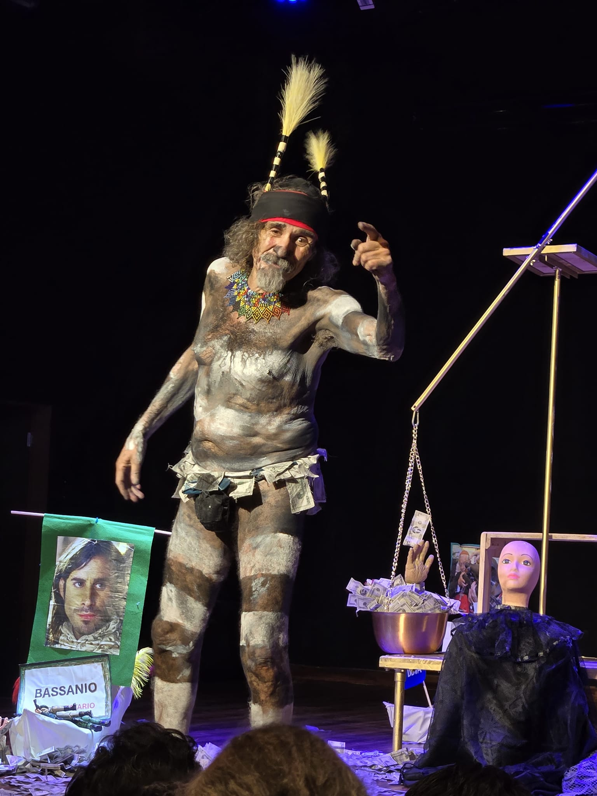
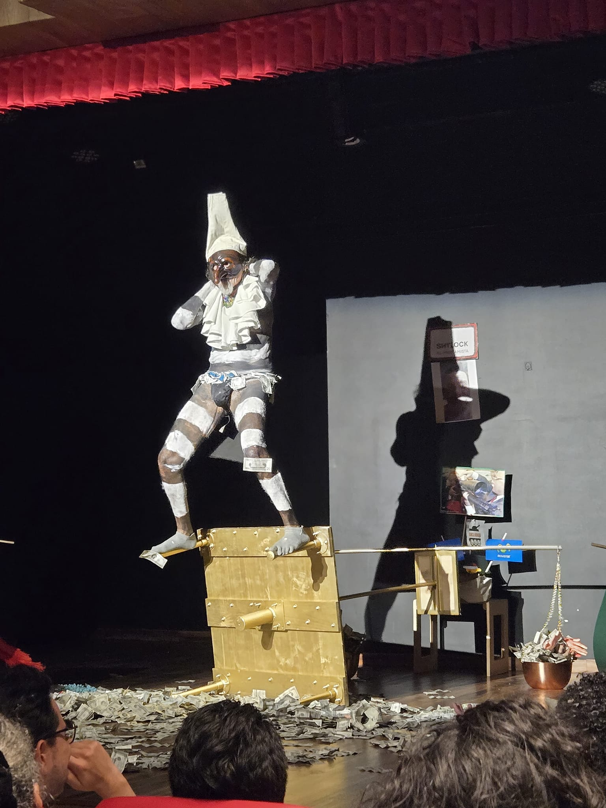
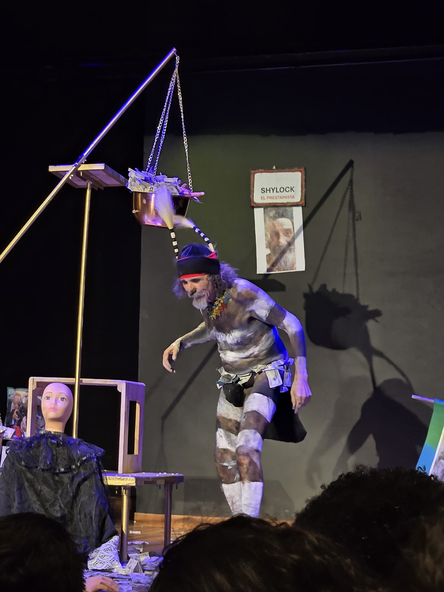

Maestro Andrés del Bosque, el publico y el comité evaluador premia su obra Banquero, y debe ir a recibir el Premio en la Barca en San Antonio el dia de hoy en el acto de Clausura Calle 4 No 9-56... De la Universidad va a salir un transporte después de la Última función.

ROBERTO ROBLES, Director Festival de las Américas 2024, Cali Universidad Santiago de Cali

<!--more-->

