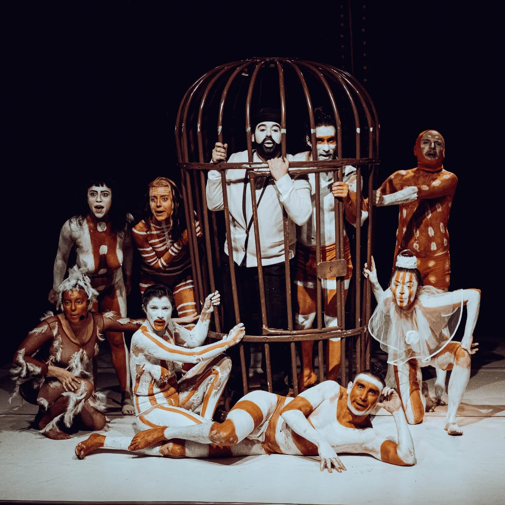

Aqui comparto el trabajo de bufones que investiga una visión donde la *risastencia* pone en práctica la poesía dramática en torno al Genocidio Selkman.

<!--more-->

Vuelven en jaulas aquello que llevaron en Zoológicos humanos al Paris de 1879 a una familia ona. Maurice Maître, Carl Hagenbeck y el Rey de la Patagonia José Menéndez, prueban su propia medicina, al ser presentados como los *eslabones perdidos* del abuso colonial.

