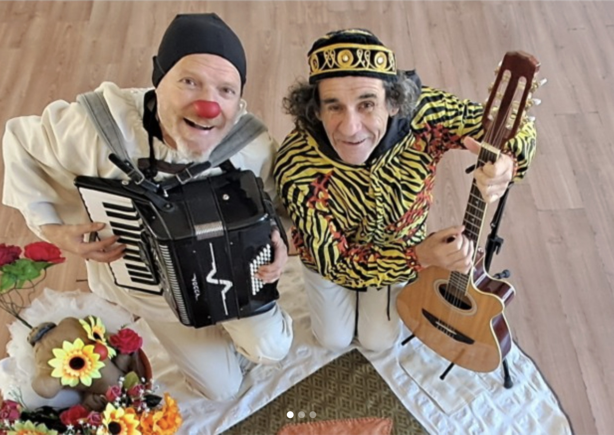

Desde el mundo de la juglaresca el *huacho* se alza contra la violación y el abuso para sostener la dignidad de su linaje con ironía,sátira y décima espinela.

Canta el derecho a reivindicar con la alegría el origen del payaso como fundador de una risa Republicana...elevando la conversación cómica a la constitución de un acuerdo, que se eleva sobre la tragedia, con la fuerza renovadora del drama satírico. 

El canto,la música y la payasada están por encima de los lloriqueos y lamentos de patriarcas ausentes. Nadie muere  en la comedia porque ya están todos muertos. Y el poeta popular trasgrede permanentemente la frontera eterna, entre la vida y la muerte.