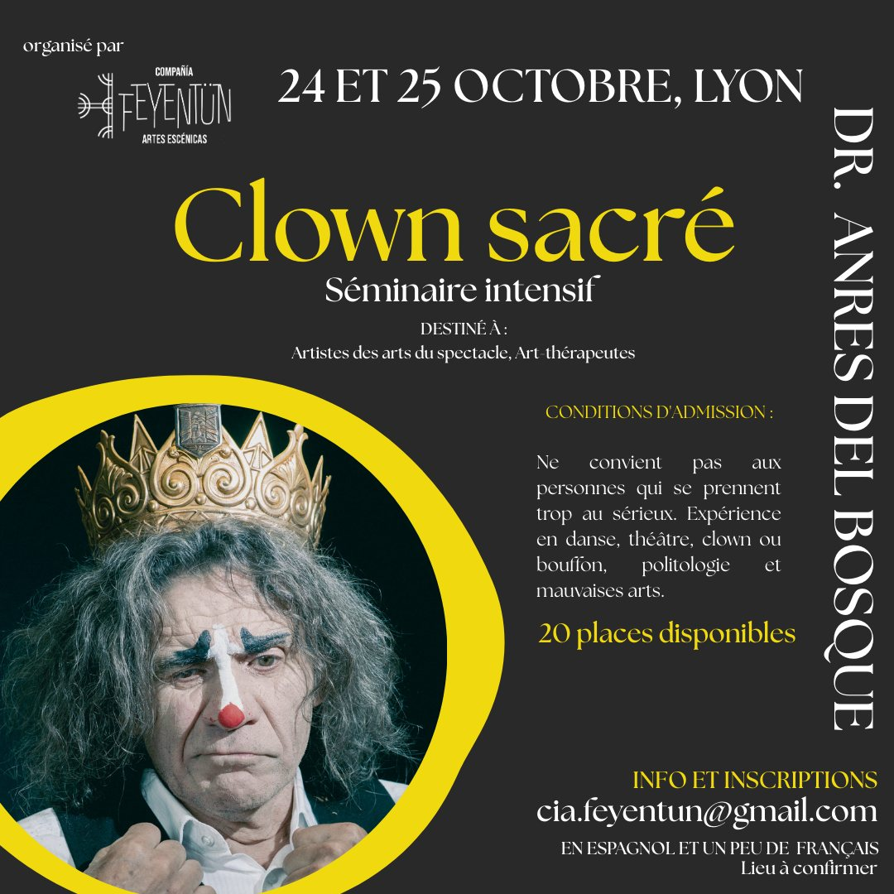
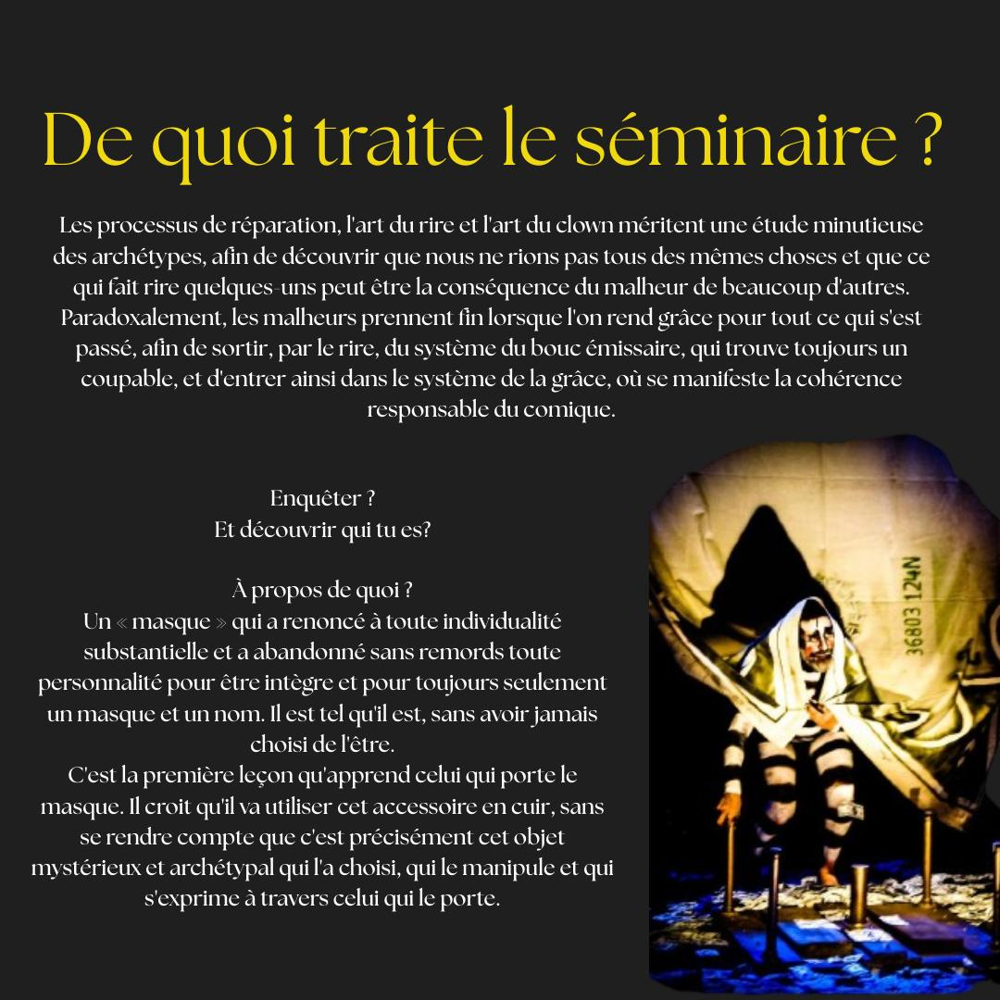
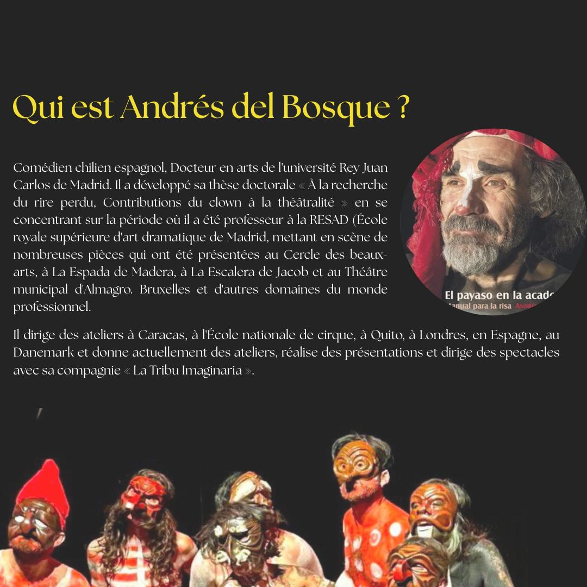

Saludos! Les queria dejar esta tremenda oportunidad 
¡Un seminario imprescindible llega a Lyon!

**CLOWN SAGRADO** por el doctor Andrés del Bosque 🎭 Andrés del Bosque
15 horas dedicadas a descubrir los secretos que se esconden tras la máscara más pequeña del mundo 🔴

<!--more-->

CONDICIONES DE ADMISIÓN:
No apto para personas que se toman demasiado en serio a sí mismas. Se requiere experiencia en danza, teatro, clown o bufones, politología y artes malvadas 😂

DESTINADO A:
Artistas de las artes escénicas, arteterapeutas ✨

Costo del seminario: 110 €

