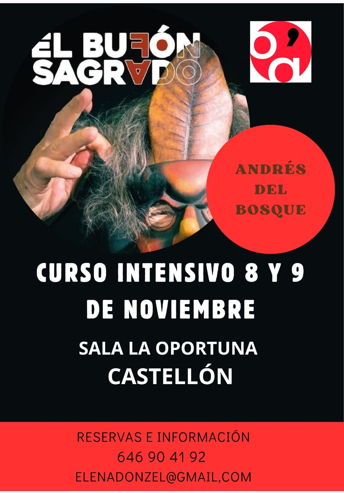

Les invito al taller de bufón sagrado que realizaremos el 8 y 9 de noviembre en Castellón de la Plana, España.

<!--more-->

Payasos demonios

Payasos y demonios están vinculados por meter la nariz donde nadie los ha llamado.
Hablamos de este demonio como daimon, guía espiritual interno, ángel custodio, o psicopompos en el sentido de conductor de almas. Lo situamos como una categoría ontológica, que desde el cuerpo siente, piensa y percibe el flujo entre realidad y ficción. Puede ser un demiurgo que en muchas de las antiguas tradiciones encarnaba un genio mediador que instigaba a realizar el viaje de nuestro destino. El recorrido por doce estaciones precisas del cuerpo genera un mapa en nuestro inconsciente, que equivale a una ruta humorística psicomotriz Órganos, endorfinas, bilis, atrabilis flemas y humores alcanzan su categoría de metáfora cómica.

El disparate que resulta de las incoherencias de nuestro recorrido vital y la carta de navegación escrita en nuestro cuerpo psicofísico es para la risa. Son los payasos demonios que nos susurran ideas en nuestro aprendizaje, estos clowns daimon que inspiran y dan voz a nuestra intuición no son entelequias que no podemos tocar, sino más bien encarnaciones como dirían las santeras, tan precisas como doce notas musicales. Nos interesa reconocer a estos genios o nahuales y nombrarlos según la tradición a la que pertenecen.

Hoy tenemos muchas y muchos que quieren ser clown y pocos que están dispuestos a hacer reír reconociendo lo irrisorio de su propia existencia. Este taller te pondrá en ese camino de autoconocimiento reconociendo que no estamos solos, sino que alguien muy especial vela por nosotros: ¡¡¡¡Payasas y payasos demonios a escena…vamos allá!!!!

OBJETIVOS:

Reconocer doce oportunidades cómicas en tu cuerpo psicofísico

CONTENIDOS:
    1. LOS DOCE MISTERIOS DEL CUERPO PSICOFÍSICO 
    2. LAS DOCE OPORTUNIDADES CÓMICAS Y SUS DAIMON
    3. ENEAGRAMA DE LAS NUEVE MASCARAS PASIONALES
    4. NUEVE MASCARAS DE LA COMEDIA DEL ARTE
    5. PAYASA, PAYASO Y PAYASOS DEMONIOS

METODO:

1.LA MASCARA INEVITABLE. (Enviar cada uno foto de la cara indicando claramente el lado derecho de la cara. El lado izquierdo ya lo saco yo por conclusión).
2. PREGUNTAS Y RESPUESTAS: JUEGO Y ASECHO DE LAS MENTACIONES
3. EJEMPLOS DE DESVIACIONES MENTACIONALES
4.  IMPROVISACION Y SUS LEYES
5. EL JUEGO LA RISA Y SUS PRINCIPIOS
6. EL DISCURSO COMICO TEXTUAL Y GESTUAL

---

