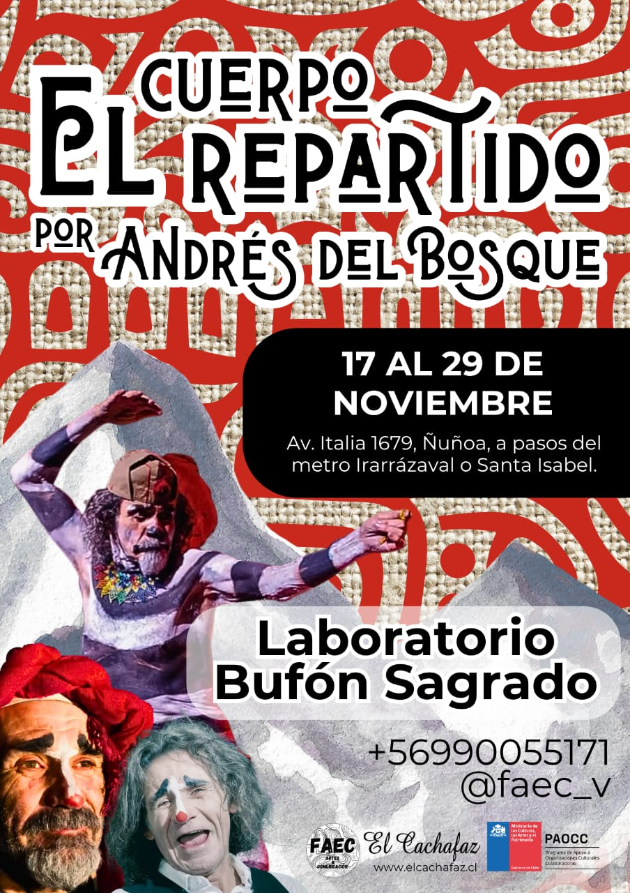
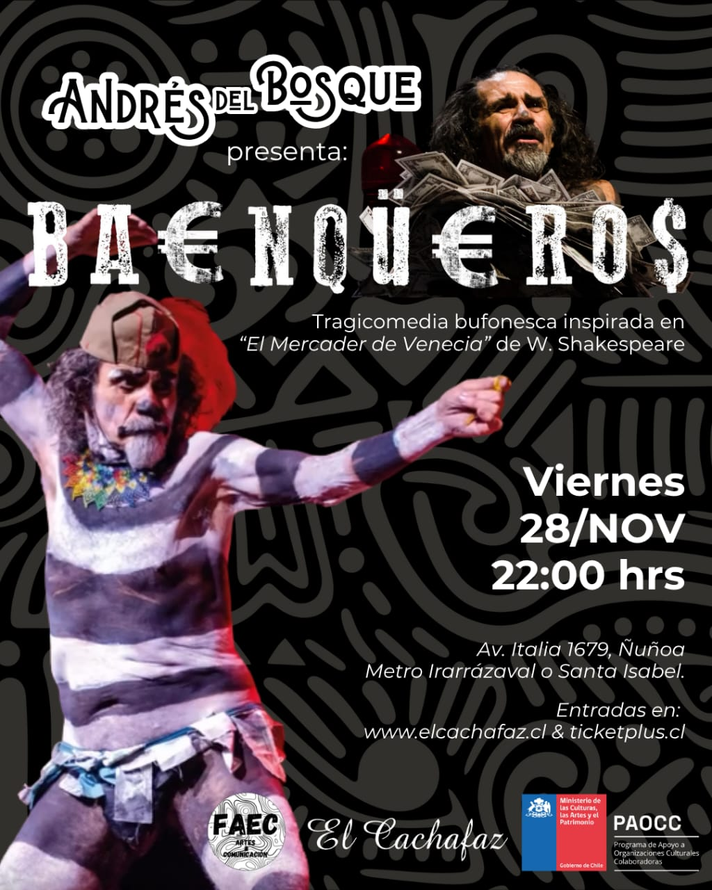

"Cual partes de un cuerpo desaparecido.
Cual extractos de un poema perdido.
Cual sombra buscando integrarse.
Cual banda de bufones que anhela la Armonía y la Unidad."

<!--more-->

📅 17 al 29 de noviembre
📍 Av. Italia 1679, Ñuñoa
⏰ Horarios variables (ver cronograma)

Un laboratorio que explora las intersecciones entre arte, política y espiritualidad a través del lenguaje del canto a lo divino y lo humano. Dirigido por el reconocido director teatral, dramaturgo y maestro bufón sagrado Andrés del Bosque.

Abierto a performers, payasxs, bufonxs, artistas callejerxs, músicxs, cantorxs, poetas y cualquier persona interesada en la creación colectiva y la memoria territorial.

CRONOGRAMA

Lunes 17  11:30 a 14:30
Martes 18  9:00 a 12:00
Miércoles 19  9:00 a 12:00 
Viernes 21  11:00 a 14:00
Lunes 24  11:30 a 14:30
Martes 25  9:00 a 12:00
Miércoles 26  9:00 a 12:00
Viernes 28  11:30 a 14:30

PRESENTACIONES FINALES

- Sábado 29: Teatro El Cachafaz
- Domingo 30: Espacio público (a confirmar)

🎪 Incluye 2 presentaciones finales con retribución económica para el elenco.

Costo: $150.000 pra la inscripcioón es necesario el abono del 50% por ticketplus ademas de llenar este formulario
(becas disponibles)

https://forms.gle/JrdEvtrrB2LLqVPg8

Este es nuestro formulario de inscripción para el laboratorio (link disponible en nuestra descripción)

---

