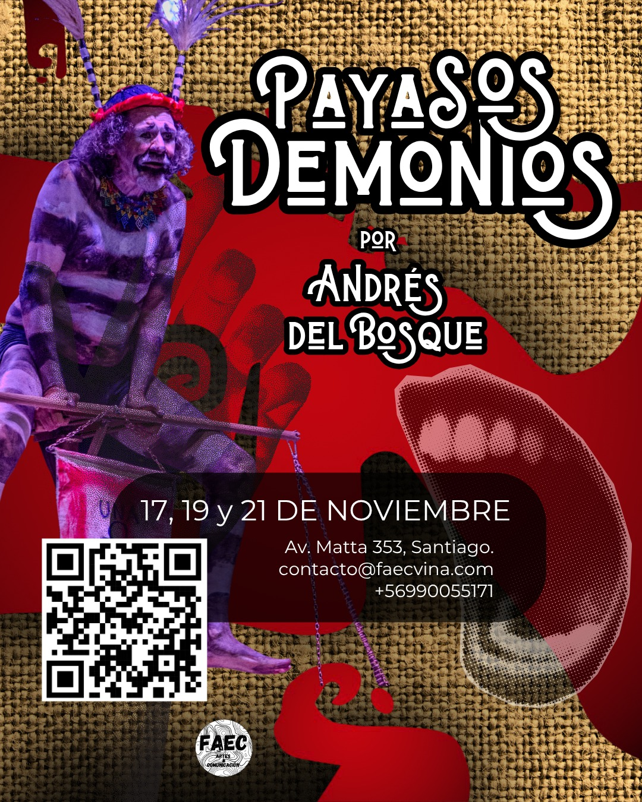

Daemon, que mete su nariz donde no se le ha llamado.
Psicopompos, conductor de almas que instiga a realizar el viaje de nuestro destino. 
El disparate de una carta de navegación, que en ocasiones parece timoneada por un embaucador o trickster surca nuestro cuerpo psicofísico y nos lleva a  un gracioso ridículo.

<!--more-->

La navegación, por doce estaciones precisas del cuerpo, genera un mapa náutico en nuestro mar inconsciente. Órganos, endorfinas, bilis, atrabilis flemas y humores trazan una ruta humorística y flotan en el horizonte de la conciencia como metáfora cómica.

Los payasos demonios inspiran y dan voz a nuestra intuición, son encarnaciones como dirían las santeras, tan precisas como doce notas musicales. Nos interesa reconocer a estos nahuales y nombrarlos según la tradición a la que pertenecen.

Hoy tenemos muchas y muchos que quieren ser clown y pocos que están dispuestos a hacer reír reconociendo lo irrisorio de su propia existencia. 
Una travesía del autoconocimiento reconociendo que no estamos solos, sino que alguien muy especial vela y despliega las velas junto a nosotros: ¡¡¡¡Payasas y payasos demonios a escena…vamos allá!!!!

OBJETIVOS
Reconocer doce oportunidades cómicas en tu cuerpo psicofísico

CONTENIDOS
    1. LOS DOCE MISTERIOS DEL CUERPO PSICOFÍSICO 
    2. LAS DOCE OPORTUNIDADES CÓMICAS Y SUS DAIMON
    3. ENEAGRAMA DE LAS NUEVE MASCARAS PASIONALES
    4. NUEVE MASCARAS DE LA COMEDIA DEL ARTE
    5. PAYASA, PAYASO Y PAYASOS DEMONIOS

METODO
 1.LA MASCARA INEVITABLE. (Enviar cada uno foto de la cara indicando claramente el lado derecho de la cara. El lado izquierdo ya lo saco yo por conclusión).
2. PREGUNTAS Y RESPUESTAS: JUEGO Y ASECHO DE LAS MENTACIONES
3. EJEMPLOS DE DESVIACIONES MENTACIONALES
4.  IMPROVISACION Y SUS LEYES
5. EL JUEGO LA RISA Y SUS PRINCIPIOS
6. EL DISCURSO COMICO TEXTUAL Y GESTUALEste taller esta incluido dentro de la gira por Chile de Andrés del Bosque en Noviembre de 2025. 

HORARIO

17, 19 y 21 de noviembre
18:00 a 22:00 horas

En Casa Payaso, Av. Matta 353, Santiago.

Apelamos a que el trabajo sea desde la disposición a la experimentación, la escucha y la creación colectiva. No se requiere experiencia teatral previa, pero sí apertura al riesgo creativo y al trabajo con contenidos sensibles.

"Los muertos reclaman su espacio entre los vivos. Confesemos finalmente dónde están, porque son ellos quienes desde el más allá nos preguntan: ¿Dónde están los vivos?"

Costo de participación

$125.000 (becas disponibles 30%, 40% y 50%)
Para la inscripción es necesaria el abono del 50% a la siguiente cuenta

Allan Urra Sobarzo
19941607-3
Cuenta Rut Banco Estado
Secretario FAEC
contacto@faecvina.com

*no hay devolución del primer abono

Rellenar [este formulario](https://docs.google.com/forms/d/e/1FAIpQLSfmrGzEd_nh11z6PMtMkLqgI-Mgsm3CMwjicqFxkAIoaWu6IQ/viewform) para la inscripcion

---

