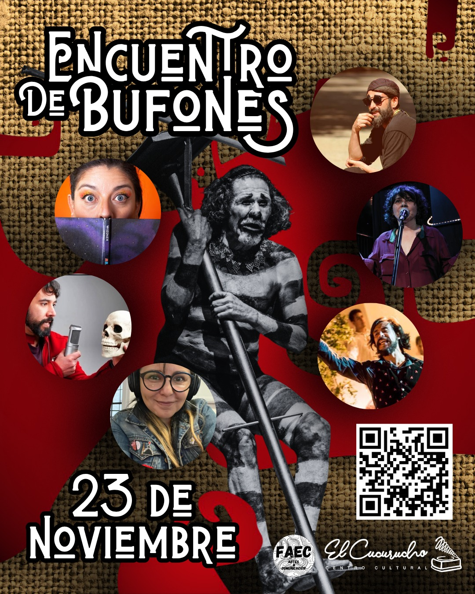

Para reunir el Cuerpo Repartido
Conversatorio con el elenco original

En noviembre de este año, Andrés del Bosque convoca a un elenco renovado para reencarnar la obra "El Cuerpo Repartido", una dramaturgia del maestro bufón, y en paralelo, propone un reencuentro con el elenco original, en un gesto de memoria, celebración y continuidad.

<!--more-->

El Encuentro de Bufones será un espacio de diálogo y reflexión entre generaciones de artistas que han transitado el lenguaje del bufón. Se abrirá también a nuevos participantes que deseen sumarse a esta experiencia única, donde el cuerpo e historia se entrelazan.

📅 Domingo 23 de noviembre
⏰ 17:00 a 20:00 hrs
📍 García Reyes 259, Barrio Yungay

Este conversatorio marca un momento histórico: la obra que transformó el teatro bufón en Chile se volverá a montar este año con el nuevo elenco del Laboratorio Bufón Sagrado
"El Cuerpo Repartido".

Un reencuentro histórico después de 25 años.
En el año 2000, una banda de bufonas y bufones se reunió en la Universidad ARCIS para crear "El Cuerpo Repartido", una performance que convirtió una décima popular en poesía dramática, respondiendo a la necesidad de crear diálogos sobre derechos humanos y los detenidos desaparecidos durante la dictadura militar.

Cada uno compartirá su desarrollo como artista escénico en estos 25 años: unos encontraron sentido en reunir relatos y vivir del cuento, otros se centraron en recuperar el músculo de la memoria, otros en la somática del cuerpo. Algunos se hicieron doctores, otras hicieron maestrías, algunos son directores de escuelas de teatro.

El cuerpo repartido era una metáfora que incluía la necesidad de reparar un cuerpo social hacia la salud. Sin embargo también nos hizo conscientes de un cuerpo individual dividido, con nuestros órganos dispersos en búsqueda de una narrativa que diera sentido a la propia existencia.

BUFONES INVITADXS:

Carla Alfaro
Carolina Pastene
Lucía Baeza
Alejandro Rivas
Natalie Barraza
Patricia Rivas
Ismael Buzata
Faviola Ruiz
Javier Díaz
Camila Saguez
Fanny Fregny
Paula Santana
Eliseo Miranda
Claudia Torres
Pablo Villablanca

✨ Adhesión $10.000 con previa inscripción a la siguiente cuenta:

Allan Urra Sobarzo
19941607-3
Cuenta Rut Banco Estado
Secretario FAEC
contacto@faecvina.com

🎪 Entrada liberada a cursantes Taller de Bufón
📧 contacto@faecvina.com
📱 +56990055171

Rellenar [este formulario](https://docs.google.com/forms/d/e/1FAIpQLSfJVmrbJooEnGeQ4-Oc5Gr5KHDfLmrjh13Dclzi_H6eyHjtHA/viewform) para inscribirse.

---

