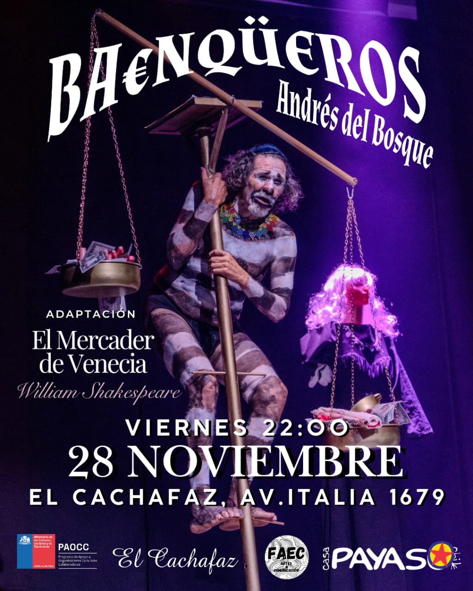

BA€NQÜEROS: 

Tragicomedia Bufonesca basada en El mercader de Venecia de William Shakespeare 

Vie 28 de noviembre a las 22.00hrs

<!--more-->

Un saltimbanqui —que podría ser banquero, profeta o bufón— sube al escenario para pedir su propio rescate financiero y espiritual. En su Biblia arrugada lleva los versículos de El Mercader de Venecia y una advertencia: la deuda no solo vacía los bolsillos, sino también el alma.

A medio camino entre el circo, la poesía y el teatro de los bufones, Andrés del Bosque construye un universo donde el humor se convierte en herramienta crítica, el dinero en objeto sagrado y el público en cómplice involuntario de la locura económica contemporánea.

📅 Viernes 28 de noviembre
⏰ 22:00 hrs
📍 Av. Italia 1679, Ñuñoa
🚇 Metro Irarrázaval o Santa Isabel

🎟️ Entradas en:
[www.elcachafaz.cl](https://www.elcachafaz.cl/) & ticketplus.cl

Dirección, Dramaturgia e Interpretación:
Andrés del Bosque
Composición musical y universo sonoro:
Juglar Teatro (Maneco y Aytana)
Espacio sonoro: Marinetti
Diseño de vestuario: La Tribu Imaginaria
Máscaras: Antonio Fava
Técnica: Allan Urra Sobarzo
Fotografía: Archivo Festival Internacional de Teatro de Manizales / Carlos Vidal

---

