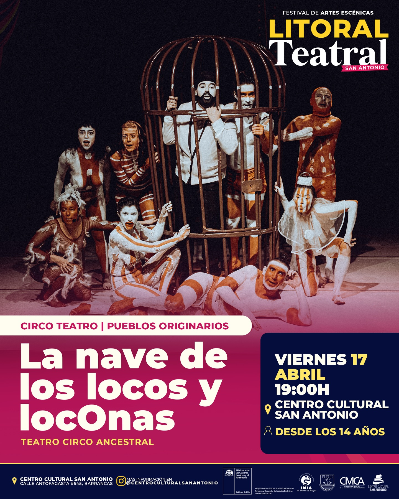

Festival Litoral Teatral 2026 | La nave de los locos y locOnasc

La compañía Circo Ancestral presenta una obra que cruza bufón, música en vivo y circo para construir un relato crítico, directo y cargado de simbolismo.

Dirigida y escrita por Andrés del Bosque, la puesta en escena toma un episodio histórico para proponer un giro potente: una familia Selk’nam, secuestrada en 1889 para ser exhibida en un “zoológico humano”, invierte los roles y expone a sus captores.

<!--more-->

A través del humor, el verso y la sátira, la obra abre una reflexión sobre la violencia hacia los pueblos originarios, desde un lenguaje cercano y provocador.

📅 La función será el viernes 17 de abril a las 19:00 horas en el Centro Cultural San Antonio

🎟️ Entradas gratuitas ya disponibles
📌 Recomendada desde 14 años

---

