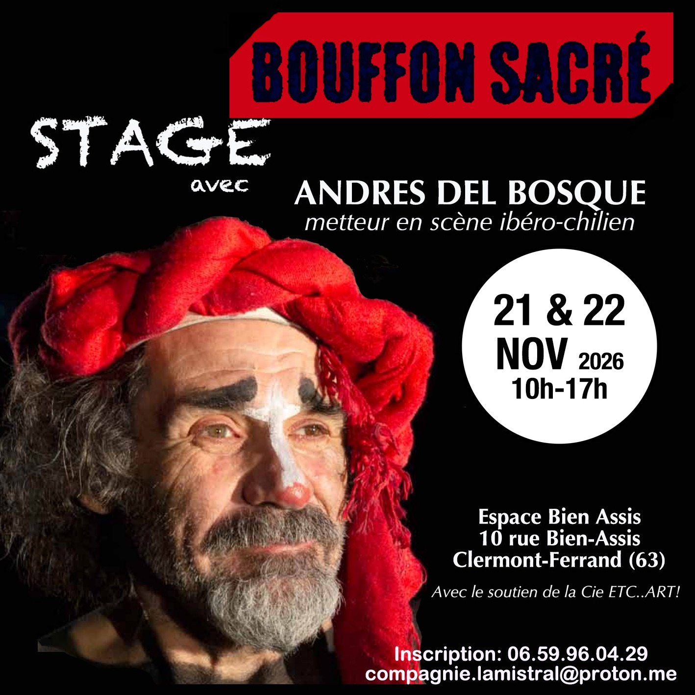

Aujourd’hui, beaucoup rêvent de devenir clowns, mais peu osent faire rire en assumant le ridicule de leur propre existence. Ce stage vous invite à mieux vous connaître et vous donne des outils pour construire un discours comique à partir de vos propres travers. Vous découvrirez aussi que vous n’êtes pas seul dans cette quête tendre et joyeuse : clowns et clowns-démons veillent sur la scène… Alors, allons-y !🔥🔥🔥

<!--more-->

💃Animé en espagnol, l'atelier est traduit par Claudia Urrutia, comédienne et metteuse en scène.

🎭Encadré par Andrés del Bosque, metteur en scène ibéro-chilien.

📆Week-end du 21 et 22 Novembre 2026
⏳10h à 17h

📍��Espace Bien Assis.10 rue Bien-Assis. 63000. Clermont-Ferrand (63000)

💶Tarif unique 120€ (facilité de paiement en 2x).
Inscription 📞 06.59.96.04.29. 
compagnie.lamistral@proton.me 

Organisé par la cie La Mistral, avec le soutien de la Cie. ETC...ART

https://www.instagram.com/p/DeESR4AjAZ_/

---

