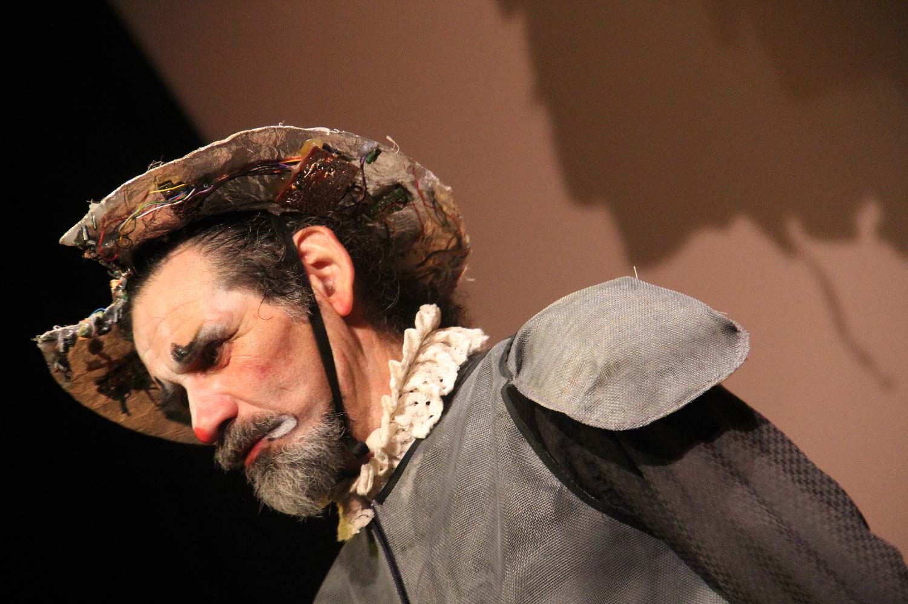

**Licenciado y doctorado en arte escénico, hoy mi experiencia de más de 40 años y mi trayectoria me permiten proponer los siguientes servicios:**

## Creador de espectáculos

De Las siete vidas del Tony Caluga a Ba€nqÜ€ro$, basada en El Mercader de Venecia, se abre un abanico tragicómico de espectáculos creados con la propia compañía, así como con diversas troupes internacionales en Chile, Colombia, Bélgica y España entre otros territorios.

## Profesor de interpretación

La interpretación entendida como trance, metamorfosis y catarsis cómica abre espacios en un teatro que a través de visiones jocosas reinventa la vida en sociedad. Magdalena PornoStar, Retrato de familia y La expulsión de los Jesuitas son algunos de los títulos que condensan una larga experiencia donde la risa despierta un humor que transforma.

## Maestro de talleres

En estos talleres de clown, bufón, melodrama y máscaras, investigas en tu propio carácter para producir el espectáculo explosivo al servicio de una conciencia cómica y libertaria.

## Orador de conferencia

El papel de los payasos sagrados modifica el discurso del sometimiento, reafirmando un logos, que propicia el lenguaje carnavalesco del mundo al revés.
