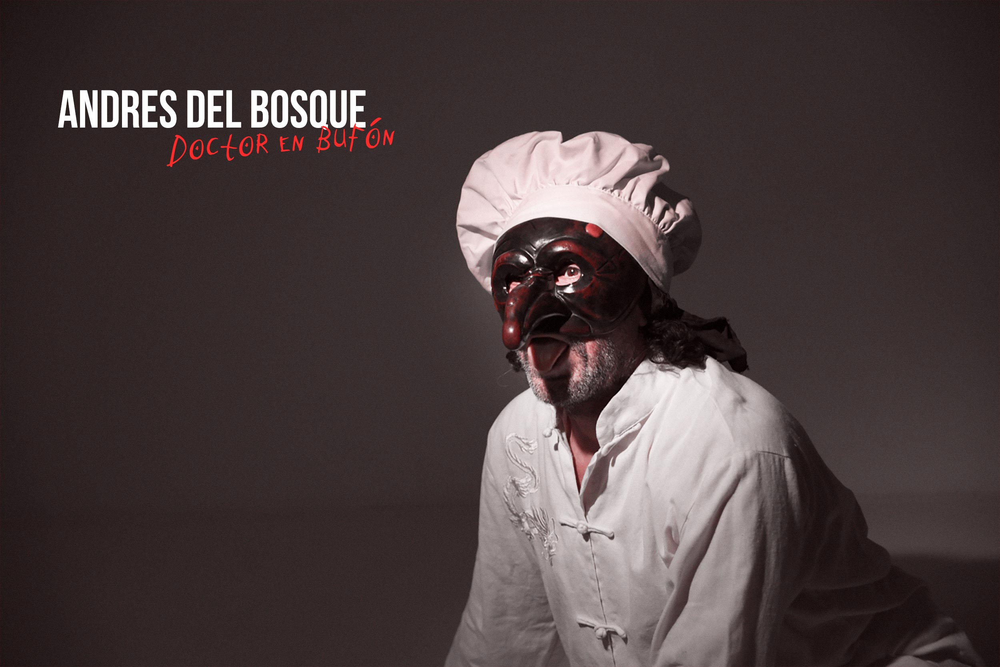
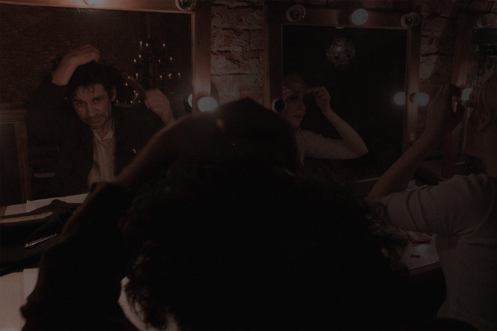

**Un bufón doctorado que divulga a través de las fronteras entre teatro y circo, lo profano y lo sagrado de la risa.   Y mientras absorbe de la comedia del arte en su vertiente de curanderismo le pisa los talones a la performance moderna.**

Doctor en Artes Escénicas, payaso cum laude, se desempeñó como profesor especialista de teatro gestual en la RESAD (Real Escuela superior de Arte Dramático-Madrid durante siete años). Docente en las Escuelas de Teatro de la Universidad de Chile, Universidad Arcis, Universidad Finis Terrae, Universidad Mayor de Temuco y Enat en México. Actualmente da clases en la ESAD de Valladolid.

Ha realizado funciones de su espectáculo BA€NQÜ€RO$ (versión bufonesca de El mercader de Venecia de Shakespeare) de Chile a México pasando por Colombia, Brasil, Italia, Dinamarca y en toda la península ibérica.

Ha dirigido numerosos montajes que han sido exhibidos en el Circulo de Bellas Artes, La Espada de Madera, la Escalera de Jacob, El Teatro Municipal de Almagro. Bruselas y otros ámbitos del mundo profesional. Es Director y autor de uno de los hitos del teatro chileno Las siete vidas del Tony Caluga.

Imparte talleres y conferencias, que vinculan risa, comedia del arte, eneagrama y danzas sufíes.  Realiza presentaciones y dirige espectáculos en diversos países y compañías.

---

