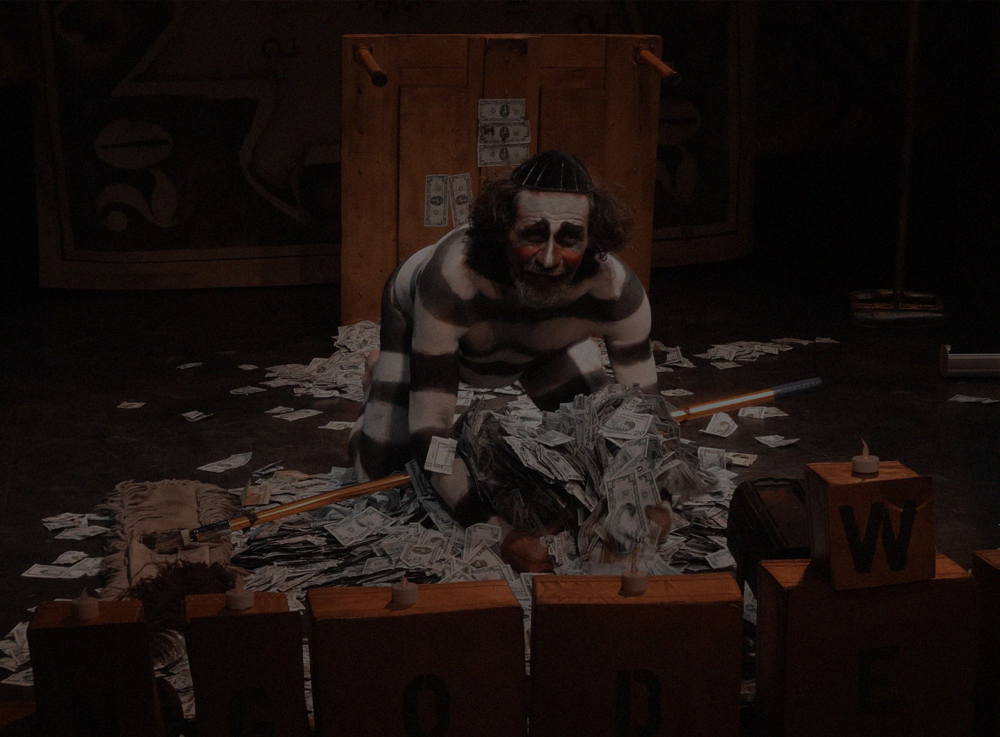
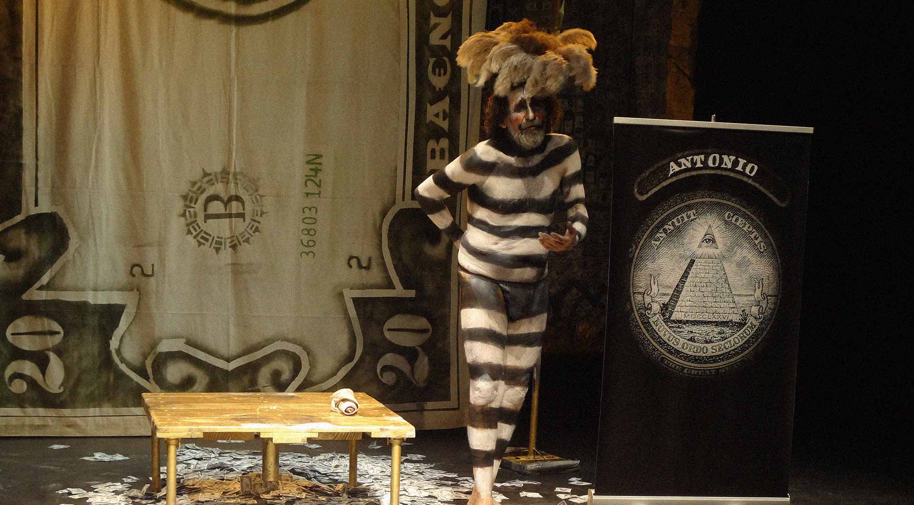
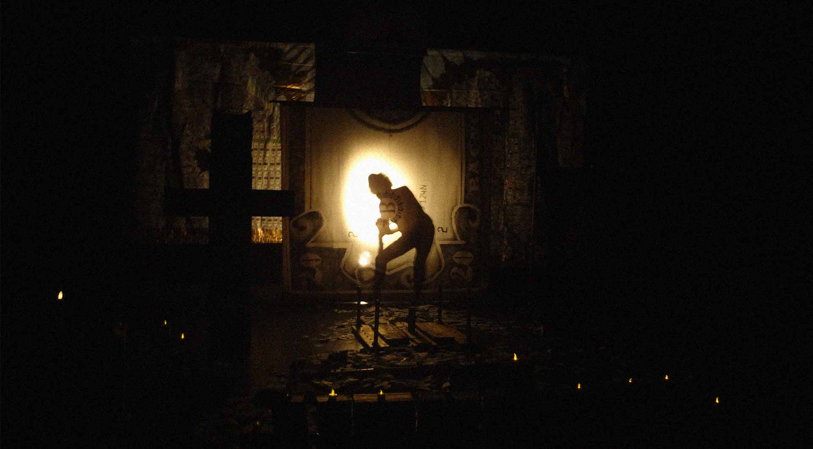
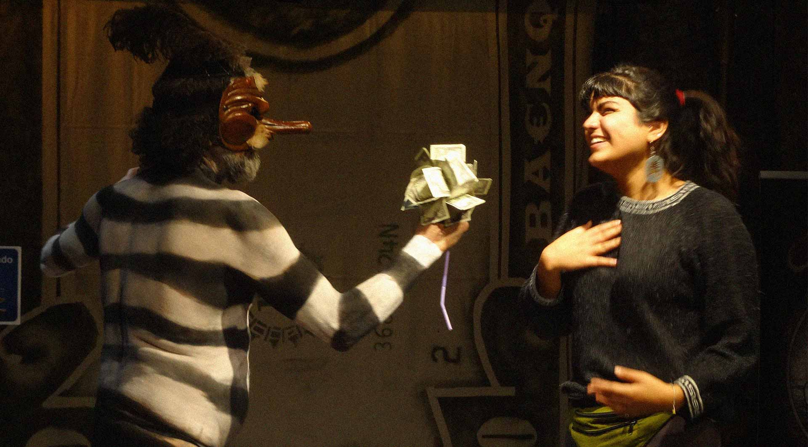
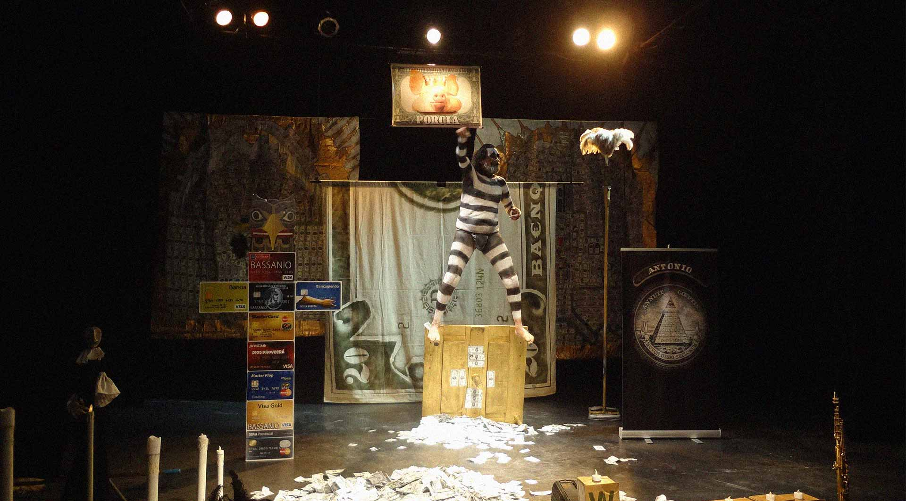
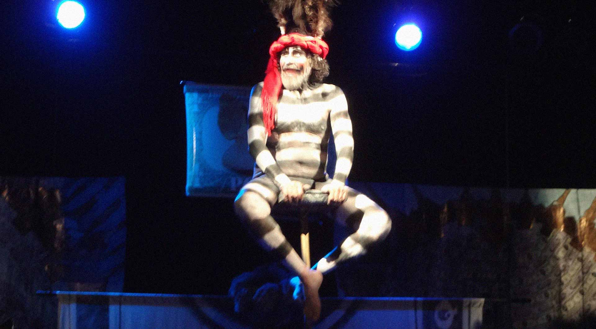


---

# Ba€nqü€ro$ de Andrés Del Bosque

**Versión bufonesca de El mercader de Venecia de Shakespeare**

**Tragicomedia Bufonesca inspirada en « El Mercader de Venecia » de William Shakespeare.**

**"Los saltimbanquis y los banqueros tienen un origen común: El banco de la plaza pública…"**

Los saltimbanquis y los banqueros tienen un origen común: el banco de la plaza pública. Los banqueros se sentaban en él para especular con el dinero arriesgando una bancarrota y los saltimbanquis especulaban con la imaginación, equilibrándose con riesgo de romperse la crisma.

Los banqueros han convertido sus crisis en un espectáculo bochornoso, en el que se presentan como mendigos para solicitar que los rescatemos con el dinero público, cada vez que se enfrentan a las turbulencias de sus guerras privadas por el beneficio sin límites, sin regulación y sin vergüenza. Ante semejante espectáculo los saltimbanquis se han quedado de espectadores.

“Ba€nqü€ro$” es la historia de un saltimbanqui que solicita su propio rescate y que predica con la Biblia de los arruinados: El Mercader de Venecia de William Shakespeare. Un manual que nos advierte de cómo se nos arrastra a la bancarrota del alma.

Este saltimbanqui se nos presenta como un banquero anarquista que denuncia el fanatismo con que muchas economías, a través de la carga de la deuda, han sido aniquiladas y que señala la acumulación de riqueza financiera, cada vez en menos manos, como un teatro cínico que ha alcanzado obscenas proporciones.

¿Quién es este vagabundo, este judío errante, que se atreve a cobrar lo que se le debe aunque tenga que arrancarle media libra de carne del cuerpo miserable, a estos sacerdotes de la especulación que se han convertido en nuestros implacables acreedores?

---

