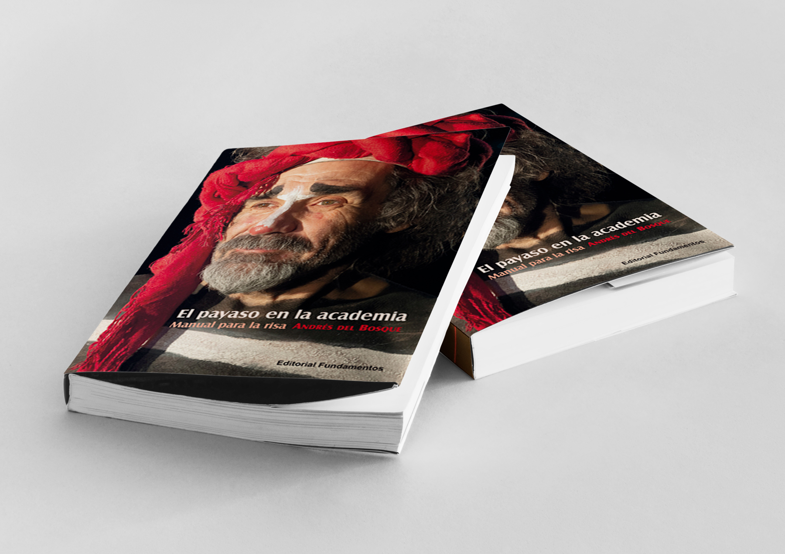

# El payaso en la academia

**Editorial Fundamentos nos enseña a reír con la última novedad de la serie Teoría Teatral**

**Este libro propone herramientas, ejercicios y reflexiones teóricas deducidos de la práctica para el montaje de un espectáculo de clown, al tiempo que defiende el valor de la comedia y la necesidad de la risa.**

Este libro es un viaje en busca de la risa perdida. En él se proponen nueve categorías de análisis para llegar a la esencia del espectáculo y concebirlo en todas sus facetas. Conjuga erudición y praxis, nos sumerge en una atmósfera en la que lo racional abre la puerta a la irracionalidad del payaso, iconoclasta reconstructor de nuestra más honda humanidad. Armoniza el rigor de lo académico con la pasión desbordante de quien reivindica el valor regenerador de la comedia.

Provocar la risa como oficio es complejo, sutil y un camino largo. Entre la tontería y la genialidad hay una línea muy estrecha. No es lo que se hace, es el cómo, el tempo, el pequeño detalle. La resolución solo es fiable después de largos años de experiencia. Quizás por ello solo después de tamizar un número con muchas actuaciones se puede intentar llegar a la esencia del payaso: la poesía escénica. El payaso en la academia es una suerte de poética de la risa que deja huella en esta dirección.

**Andrés del Bosque** es doctor en Artes Escénicas y licenciado en Dirección Teatral. Formado en Colombia con Enrique Buenaventura y especializado en clown y bufón con Philippe Gaulier, Antonio Fava y Vladimir Kryukov, es director y autor de la mítica Las siete vidas del Tony Caluga. Como clown, ha participado en el legendario grupo Tábano. Ha recibido el premio al mejor actor en el Festival de Cine de Bogotá, el primer premio de dramaturgia de la revista Parábasis, el premio de la Asociación de Periodistas de Espectáculos de Chile, el Eugenio Dittborn de la Universidad Católica y el premio de Dramaturgia de la municipalidad de Santiago de Chile.

[PARA COMPRAR EL LIBRO](http://www.editorialfundamentos.es/index.php?producto=1633831&section=catalogo&pagina=producto&idioma=es)

