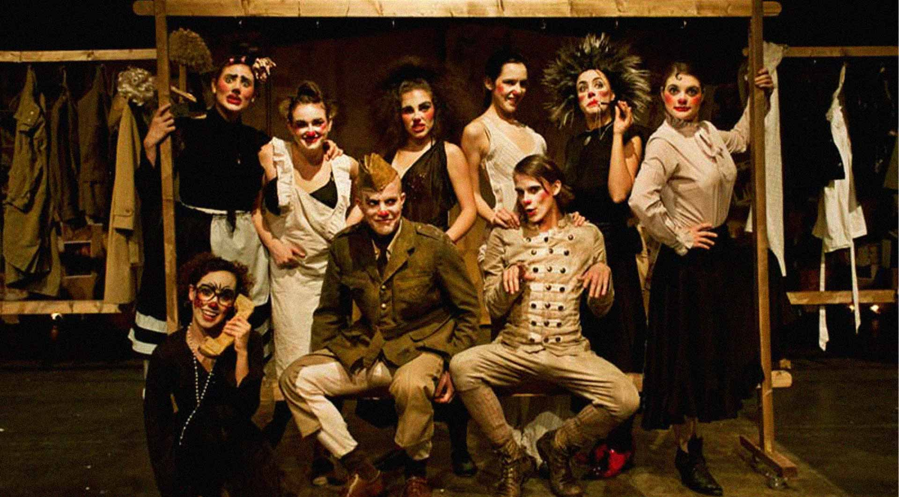
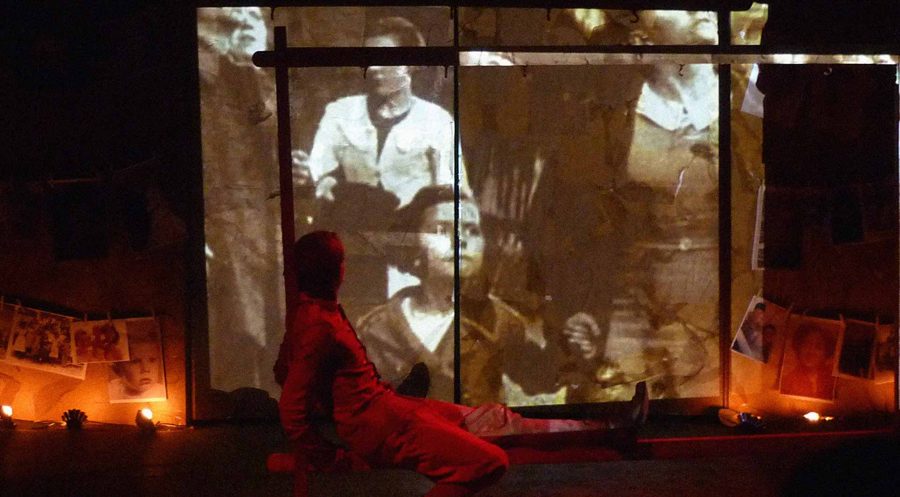
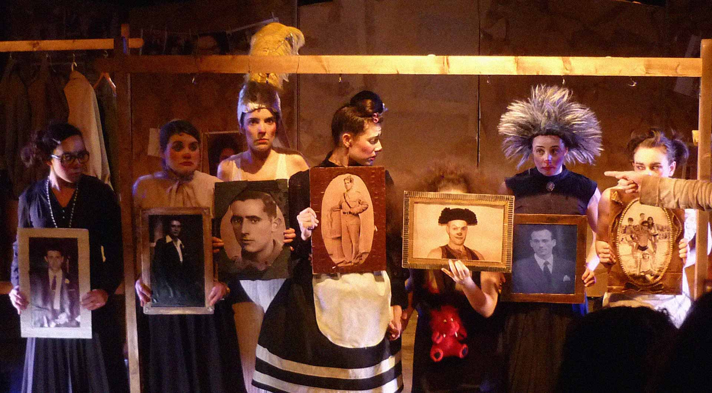
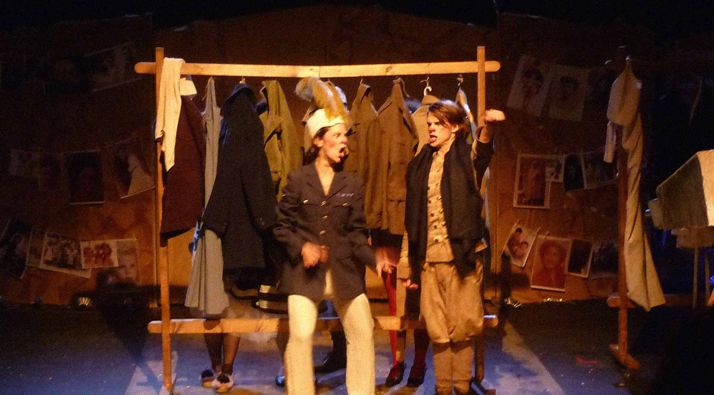
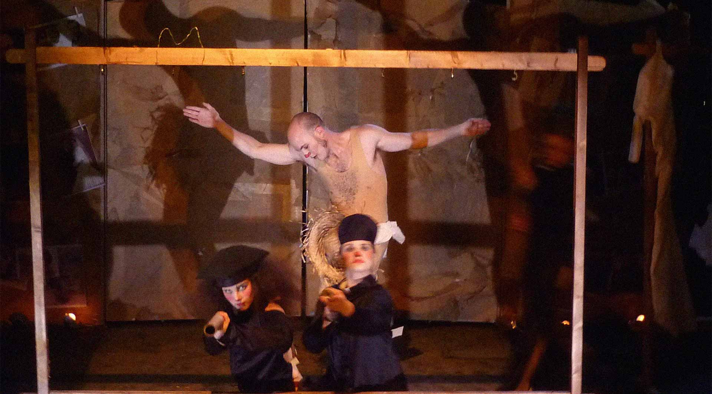

**Payasos en la Real Escuela Superior de Arte Dramatico de Madrid**

TODO: El video original ya no existe https://andresdelbosque.com/portfolio_page/clown-en-la-resad/

El aporte del payaso incide en un teatro animista, humanista y animalista. Dota de espíritu, ora y dialoga con las sillas, los paraguas, las cachiporras y las tartas. Se transforma como un chamán en cacatúa o pretende ser un león y saltar por el aro.

Presenta el mundo en que vivimos sin representarlo, rompe todas las convenciones teatrales mostrando que todo estilo es un acuerdo, todo privilegio es provisorio, toda jerarquía es una hipótesis y se salta con frecuencia la frontera entre actor y espectador.

Los payasos aportan una dramaturgia descuartizada, hecha de pedazos similares a un teatro de feria y varietés, cuyos números y trozos se buscan para crear el sentido de la fábula, así como los cuerpos descoyuntados y artificiosos de las actrices, que en danza macabra, reúnen sus huesos para presentar su historia frente al público, tal como en el Mito del Cuerpo desmembrado.

A esto apunta el trabajo del clown: Lo que se imita es el modelo divino narrado en el mito de los orígenes. Y la paradoja consiste en que el recuerdo despeja el futuro y desarrolla el carácter visionario. La teatralidad del clown es adivinatoria.

---

