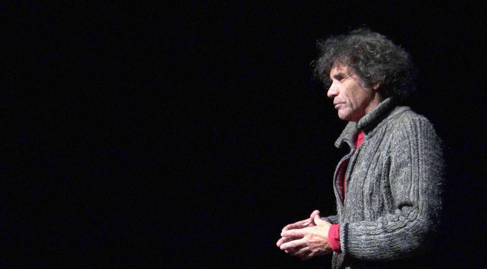
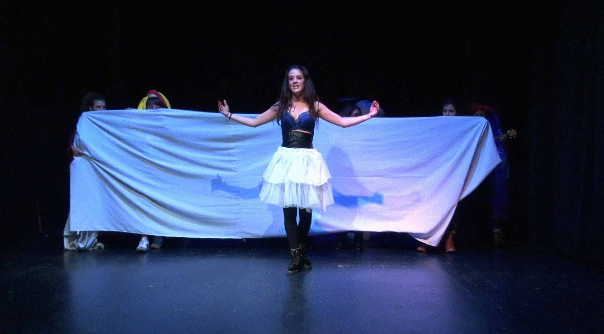
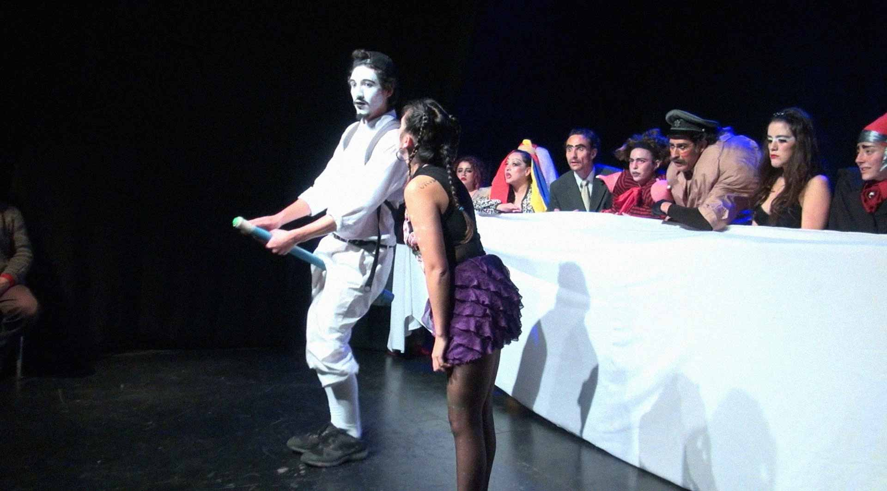
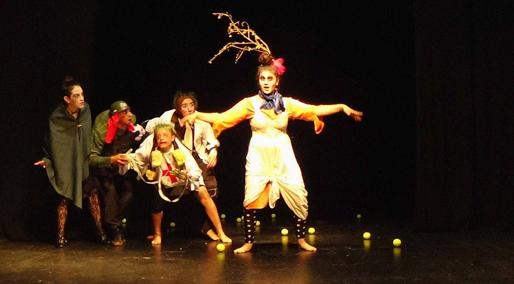
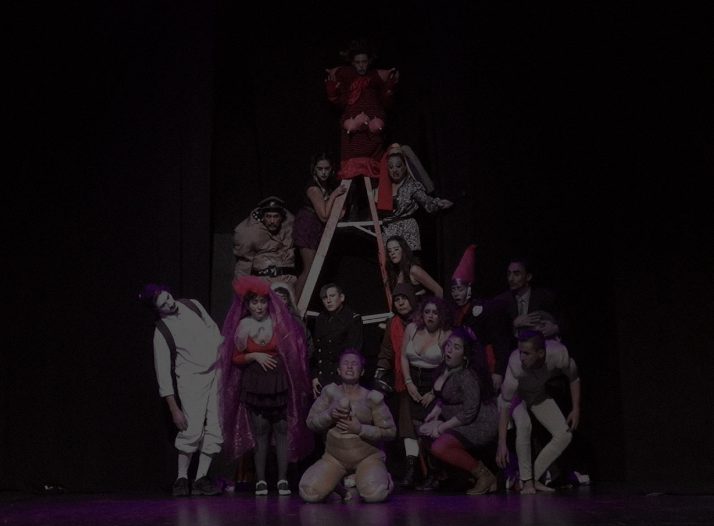


---

**Talleres de juegos e improvisación con 30 alumnos**

**Taller de bufon sagrado**

En esta nueva Edad media, con el Castillo de los Privilegios defendido por una policía Global y una guerra preventiva, los bufones sagrados, bajan el puente levadizo y celebran La Fiesta del Papa de las Burlas, para ver caer las falsas jerarquías, ahuyentando el miedo con la risa que revela nuestras propias jorobas y claudicaciones.

Algunos bufones se hacen favoritos del rey y se bajan los pantalones para hacer reír, otros van con el cipote en ristre o con bufonas que ponen el mundo patas arriba con la sonrisa vertical. Estas bandas y cofradías son las de los bufones sagrados. Una revuelta permanente.

##### Objetivos

- Reconocer un camino de transformación de vicios jorobas claudicaciones y defectos a través de la Risa, la Gracia y la Ternura.
- Reconocer las evidencias de bufón ritual en diversas culturas.

##### Contenidos

- Juegos y Bailes Bufonescos
- Parodias
- Textos de bufones (Ghelderode, Shakespeare, otros)
- Exposición de investigación en torno al bufón sagrado

##### Metodo

- Juegos
- Improvisación
- Trabajo con Textos

---

